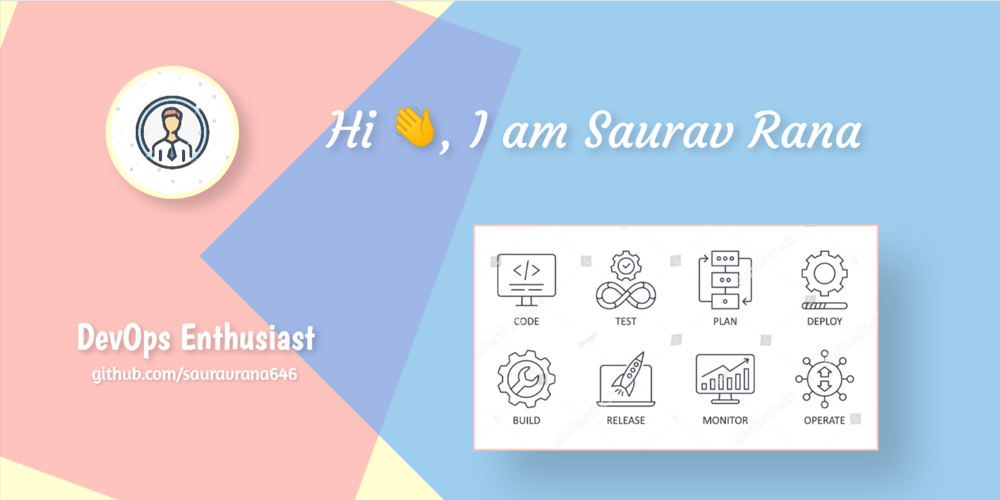

<!-- 

 -->
<!--   -->

<!-- <h3 align="center">Devops enthusiast</h3> -->

 

I'm 22-year-old boy with passion to learn about the DevOps Landscape. I love to explore things and deep dive into how these little pieces of code come together to form such state-of-the-art tools.

- 🔭 I’m currently working on **Kubernetes**

- 🌱 I’m currently learning **Cloud Controller Manager**

- 📝 I regularly write articles on **lastest tech** and my **experiences**

- 💬 Ask me about: **DevOps**

- 📫 How to reach me: **[sauravrana646@gmail.com](sauravrana646@gmail.com)**

- ⚡ Fun fact: **I love to experiment and learn stuff the hard way**

 

## :handshake: &nbsp;Connect with me:

&nbsp;&nbsp;&nbsp;  

 

## :computer: &nbsp;Talking to Computers Using :

### &nbsp; Languages

 

&nbsp;&nbsp; 

### &nbsp; Frameworks and Tools
&nbsp;&nbsp; &nbsp;&nbsp; &nbsp;&nbsp; &nbsp;&nbsp; &nbsp;&nbsp; 

 

 

## :chart:&nbsp; Stats for Nerds

 

| |  |
|-------|----------|

## :bookmark_tabs:&nbsp; Contribution Graph

